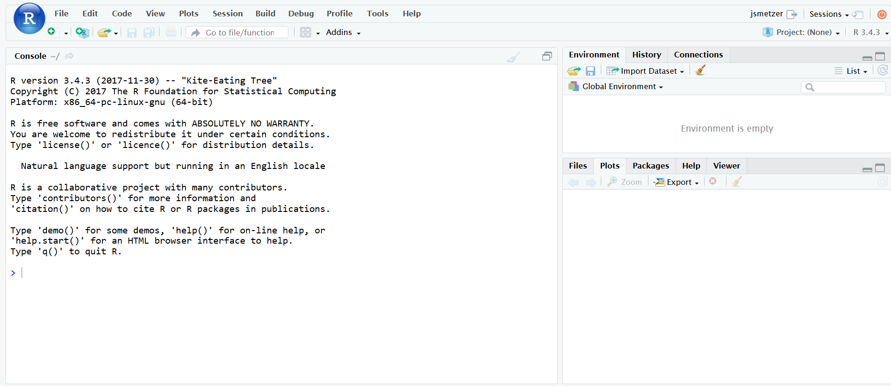
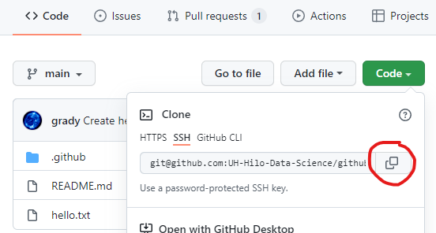
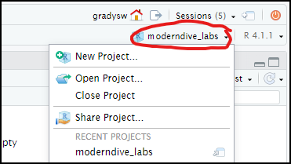
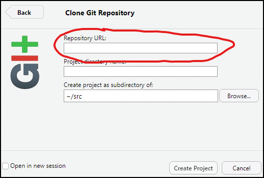

The goal this week is to introduce you to R and RStudio which you'll be using throughout the course both to review the statistical concepts discussed in the  course and to analyze real data and come to informed conclusions. To clarify which is which: R is the name of the programming language itself and RStudio is a convenient interface. 

Today we begin with the fundamental building blocks of R and RStudio: the interface, creating and saving files, and basic commands.

We will also introduce Git and Github, tools for managing and tracking changes in software projects. You will be submitting your work in this course through Github.

# Opening RStudio Server

Open the UH Hilo Rstudio server by visiting [data.uhh.hawaii.edu](https://data.uhh.hawaii.edu).

This system is managed by Prof. Weyenberg and runs on some elderly math department hardware. It could fail at any time, and there are no backups. Use this system at your own risk and be sure to keep regular backups.

There are some other options for using RStudio that you may also consider:

You can install and manage the software on your own computer. You will need to install both R from https://cran.r-project.org and Rstudio Desktop from https://www.rstudio.com/products/rstudio/. You will also need to install R packages yourself. This method of using the software keeps everything on your own computer and can be used offline.

A third option is to use https://rstudio.cloud/. This is a commercially hosted version of the RStudio server software, with a free tier of account. This is hosted in the cloud and is probably the easiest and safest option. However, the free account has a limit of 25 hours per month on it, which might not be enough. You can upgrade the free account to 75 hours per month for a $5/mo charge.


# The RStudio Interface

Whichever method you choose, once everything is set up/logged in you should see something like the image below.




The panel on the left is where the action happens. It's called the *console*.  Every time you launch RStudio, it will have the same text at the top of the  console telling you the version of R that you're running.

The panel in the upper right contains your *workspace*. This shows the variables and objects you define during your R session, and a history of the commands that you enter. 

Any plots that you generate will show up in the panel in the lower right corner.  This is also where you can browse your files, and access help files, and upload and download files. 

## Running commands in the console

You can directly enter R commands in the console and then press `Return` to run them. If you type something like `1 + 2` into the console and run it, R should respond with output that says `[1] 3`.

You can move keyboard focus to the Console with the shortcut `Ctrl-2`.  The shortcut `Alt-Shift-K` will bring up a list of other keyboard shortcuts available to you. Learning the common keyboard shortcuts can save you a lot of time in the long run. Plus, it makes a lot of people think you are a computer wizard.

A quick way to get help on a R command is to enter a `?` and then a command name into the console. Try entering `?sum` now. The lower-right pane should pop up with the help file for the `sum()` command.

# Github Setup

This setup needs to be done once per RStudio installation. The commands here are entered into the __Terminal__, which is used to interact with the computer which is running R, instead of R itself. We can use the Terminal to get the computer to run programs outside of R, which we need to do to setup the connection with Github.

- Go to the Terminal pane, (`Alt-Shift-M`), enter the command `ssh-keygen`. Press enter without typing anything when asked for a file name, and then enter a password twice. This password doesn't really need to be difficult, but it is not good to leave it blank. 

```
gradysw@gauss:~$ ssh-keygen
Generating public/private rsa key pair.
Enter file in which to save the key (/home/gradysw/.ssh/id_rsa):
Enter passphrase (empty for no passphrase): 
Enter same passphrase again: 
Your identification has been saved in /home/gradysw/.ssh/id_rsa.
Your public key has been saved in /home/gradysw/.ssh/id_rsa.pub.
The key fingerprint is:
2048 SHA256:ue5ceVeXsn5GMqZBwYjc3WFGjyT/u/ay7las5OlyTDw gradysw@gauss (RSA)
+---[RSA 2048]----+
|      . o +.o*.  |
|       o o +*.o  |
|            .o . |
|         . .  . .|
|        S .  o +o|
|         . o +Eo=|
|        . o =*=* |
|       o . oo.O+.|
|       .+    OO+o|
+----[SHA256]-----+
```

- The terminal should have printed out a line that says `Your public key has been saved in [FILENAME]`.

```
Your public key has been saved in /home/gradysw/.ssh/id_rsa.pub.
```

- If you used the default settings, then you should now enter the command `cat ~/.ssh/id_rsa.pub` into the terminal. (Otherwise, enter the command `cat FILENAME`, where you copy and paste the public key filename (without the last period) from the previous step.) It should spit out a bunch of nonsense that begins with "ssh-" and ends with something that looks sort of like an email address. You will need to copy and paste that bunch of output into Github in an upcoming step. (Don't actually put the key below into github, or I will have full access to your account.)

```
ssh-rsa AAAAB3NzaC1yc2EAAAADAQABAAABAQC9gubKifTEg89rDvpdmb/l4eLaX5au5vgy0fyrIvR7M5W/v7LZLWPvZ3D3JkusTTlQvKD4JOPu7XJVH4Fu7P4X28bxJ22An2m8yG20zXfMg9jCx3dDDEpeh9XqNGaTxKnQu/xx71VJAamIwB2yuofV9VBZTLyZvb+BHkueehCyzpxt27oDi3XCkJaWw4qx6V2SE0hePSHB91EFlCyWtVYk3ClT69V9M380ABgh5Fiz72yiht2aBbCz4DTQ++IzzyLB9hlzDvXFSARwRDFzBOiL0UjAa7JV+1l5wDZi2N1eTk/Vx3XEYXr89ss3v3bN/YbrRBa4C8nYxRs16sQtuM9T gradysw@gauss
```
- Create/log in to your Github account. (You may also want to [apply for the student upgrade](https://education.github.com/discount_requests/student_application) to Github pro, but this is optional.)
- In Github, go to account Settings (top right menu), and select the ["SSH and GPG keys"](https://github.com/settings/keys) area. Press the green ["New SSH Key"](https://github.com/settings/ssh/new) button near the top right, and add the public key you just generated. Use something like "UHH RStudio" for the title and paste the public key string into the "key" box. The [Github help](https://docs.github.com/en/authentication/connecting-to-github-with-ssh/adding-a-new-ssh-key-to-your-github-account) pages have more detailed instructions.
- Test that everything works by going back to the RStudio terminal and trying `ssh -T git@github.com`. You should 
get a message about successfully authenticating.

```
gradysw@gauss:~$ ssh -T git@github.com
Warning: Permanently added the RSA host key for IP address '140.82.114.3' to the list of known hosts.
Enter passphrase for key '/home/gradysw/.ssh/id_rsa': 
Hi grady! You've successfully authenticated, but GitHub does not provide shell access.
```

## Cloning an assignment project

RStudio organizes work into "Projects", which are mostly just folders in the file system plus a few settings. You can create projects from scratch, but many of the assignments in this course will be "cloned" from a template on Github. 

- Find the link to a Github Classroom Assignment on Laulima. The first time you use one of these links you will need to pair your github account account to a name in the class roster. After that everything should be automatic. 
- Visit your new assignment repository, go to the green "Code" button and copy the clone URL by clicking the copy button next to it.



- Return to RStudio and open the project drop down menu in the top right and select New Project. You can also go to File > New Project.



- Select "Version Control", then "Git". Paste the Clone URL from the last step into the Repository URL area and click "Create Project".



You should now be set up with a new R project which is copied from the template on github. Everything should be configured for you to eventually submit your work back to github when you are finished.
